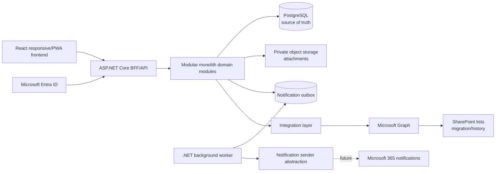

# Architecture Overview

This system is a corporate leave management application that replaces the current SharePoint-list-based operation with an independent web application. Microsoft 365 remains an identity and integration provider, not the operational platform or primary database.

Source: `../reference/Arquitectura_Alcance_Sistema_Licencias.docx`.

## Core decisions

| Area | Decision |
| --- | --- |
| Application model | Independent responsive web application, optionally installable as a PWA. |
| Backend | ASP.NET Core on .NET 10, organized as a modular monolith. |
| Frontend | React + TypeScript. |
| Authentication | Microsoft Entra ID using OpenID Connect/OAuth 2.0. |
| Session model | Prefer same-origin Backend-for-Frontend with secure `HttpOnly`, `Secure`, `SameSite` cookies. |
| Persistence | PostgreSQL is the future source of truth. |
| Files | Private blob/object storage for attachments and medical certificates. |
| Integrations | Microsoft Graph encapsulated behind integration services. |
| SharePoint | Migration/historical source only; not the transactional source for the new system. |
| Authorization | Backend-enforced Role + Organizational Scope. |
| Leave rules | Configurable and versioned policies; no hardcoded business rules. |
| Balances | Immutable ledger; visible balances are derived, not directly edited. |
| Notifications | Transactional PostgreSQL outbox for lifecycle events, processed by `Licenses.Worker` through a provider-neutral sender. |

## Logical architecture

## Backend module boundaries

The backend should remain a modular monolith, not a microservice system. Logical modules:

- Identity
- Organization
- Authorization
- LeaveManagement
- Policies
- Balances
- Approvals
- Documents
- Notifications
- Integrations
- Audit

Domain code must not depend directly on Microsoft Graph, SharePoint, Azure, PostgreSQL, HTTP, or React. Adapters and infrastructure code translate external details into internal contracts.

## Component responsibilities

| Component | Responsibility |
| --- | --- |
| Identity & Provisioning | Map Entra users to local `User` profiles without storing Microsoft passwords. |
| Authorization Service | Resolve Role + Organizational Scope and enforce backend policies. |
| Leave Service | Orchestrate requests, states, comments, and administrative actions. |
| Policy Engine | Resolve effective policy versions and calculate days, conflicts, required attachments, approval requirements, and capacity checks. |
| Balance Service | Manage balance accounts, reservations, consumption, refunds, and immutable ledger entries. |
| Approval Service | Build approval workflows and persist decisions. |
| Document Service | Validate, store, authorize, and audit attachments. |
| Integration Service | Encapsulate Microsoft Graph, SharePoint migration, and Microsoft 365 notifications. |
| Notification Worker | Processes committed outbox events with PostgreSQL polling, SKIP LOCKED claiming, retries, dead-letter state, and provider-neutral delivery. |
| Audit Service | Record security and business audit evidence with correlation IDs. |

## Architectural principles

1. Backend is the authority for authorization and business rules.
2. Frontend visibility is never a security control.
3. Variable rules live in versioned configuration.
4. Balance is reconstructed from immutable transactions.
5. Microsoft integrations use least privilege.
6. Medical attachments are private and separately authorized.
7. PostgreSQL is the future source of truth.
8. SharePoint details stay inside the migration/integration layer.
9. The MVP should close the full identity-to-audit cycle, not only request approval.

## Related documents

- [Domain model](domain-model.md)
- [Authorization](authorization.md)
- [Database](database.md)
- [API](api.md)
- [Security](security.md)
- [Integrations](integrations.md)
- [Product requirements](../product/requirements.md)
- [Workflows](../product/workflows.md)