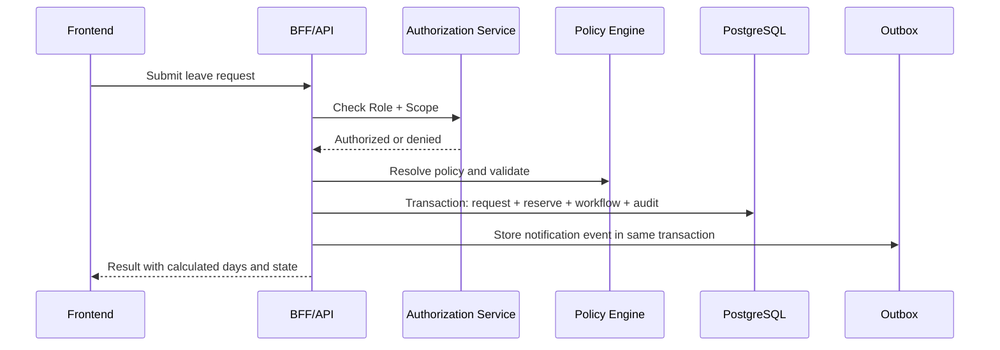

# API Architecture

The API is the authoritative boundary for authentication, authorization, validation, workflow transitions, balance ledger changes, document access, migration, and audit.

## API principles

- Commands validate authorization, policy, state transitions, and concurrency in the backend.
- Queries filter by Role + Organizational Scope in the backend.
- Critical commands use idempotency keys or command identifiers.
- File content is accessed only through authorized backend flows or short-lived delegated URLs.
- Notification delivery is decoupled through a transactional outbox.

## Endpoint groups

| Group | Examples |
| --- | --- |
| Identity | `GET /me`, `GET /me/permissions` |
| Balances | `GET /me/balances`, `GET /users/{id}/balances`, `GET /balance-accounts/{id}/transactions` |
| Requests | `POST /leave-requests`, `POST /leave-requests/{id}/submit`, `GET /leave-requests/{id}` |
| Decisions | `POST /leave-requests/{id}/approve`, `POST /leave-requests/{id}/reject`, `POST /leave-requests/{id}/request-cancellation`, `POST /leave-requests/{id}/approve-cancellation`, `POST /leave-requests/{id}/reject-cancellation`, `POST /leave-requests/{id}/revoke` |
| Team | `GET /org-units/{id}/members`, `GET /team-calendar` |
| Policies | `GET /leave-types`, `POST /leave-types`, `GET /policies`, `POST /policies`, `POST /policies/{id}/publish` |
| Documents | `POST /leave-requests/{id}/attachments`, `GET /attachments/{id}/content` |
| Audit | `GET /audit-events` |
| Migration | `POST /migration/sharepoint/jobs`, `GET /migration/jobs/{id}` |

These are orientation-level endpoints from the proposal, not final API contracts.

## Command flow

## Idempotency

Use idempotency keys or command IDs for operations vulnerable to retry duplication: submit request, approve/reject, resolve cancellation, revoke leave, adjust balance, import SharePoint data, and process outbox messages.

## Related documents

- [Authorization](authorization.md)
- [Database](database.md)
- [Workflows](../product/workflows.md)

## Implemented EP-08 approval endpoints

EP-08 adds explicit leave-request decision endpoints:

- `GET /api/leave-requests/pending-approval`
- `POST /api/leave-requests/{id}/approve`
- `POST /api/leave-requests/{id}/reject`

Approve/reject payloads accept only `operationId` and decision `comment`. They do not accept arbitrary status, employee id, calculated days, policy version, balance account, reservation id, or settlement id. There is no generic status endpoint.

## Implemented EP-09 lifecycle endpoints

EP-09 adds explicit endpoints for post-approval lifecycle and manual creation:

- `GET /api/leave-requests/pending-cancellation`
- `POST /api/leave-requests/{id}/request-cancellation`
- `POST /api/leave-requests/{id}/approve-cancellation`
- `POST /api/leave-requests/{id}/reject-cancellation`
- `POST /api/leave-requests/{id}/revoke`
- `POST /api/users/{userId}/leave-requests`

These commands use operation ids for idempotency. They do not accept caller-supplied status, calculated days, policy version, balance account, reservation id, or settlement operation id.
