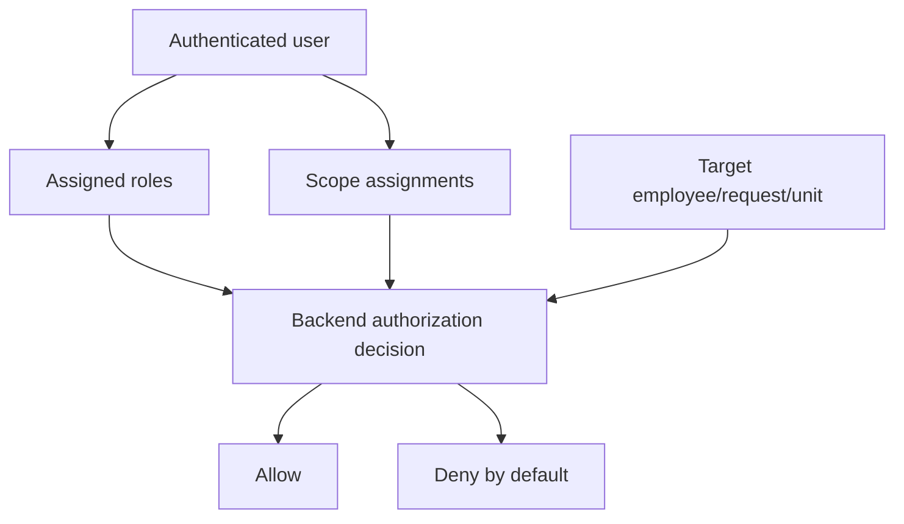

# Authorization Architecture

Authorization is always enforced by the backend. Effective permission is calculated as **Role + Organizational Scope**.

## Authorization model

## Rules

- Role answers: what can this actor do?
- Scope answers: who or which unit can this actor operate on?
- A supervisor may only operate on users inside assigned scope.
- An encargado may include descendant organizational units when configured.
- RRHH can have organization-wide functional access.
- Technical administrators do not automatically receive HR authority or medical-document access.
- Frontend hiding or showing controls is usability only, never security.
- Lack of explicit permission means deny.

## Scope assignment

A scope assignment combines user, role, root organizational unit, and an include-descendants flag.

A user may belong to a primary unit and optional secondary units. Scope expansion must be resolved in backend queries and commands, with cache invalidation when the organization tree changes.

## Permission matrix

The product-facing role matrix lives in [roles-permissions.md](../product/roles-permissions.md). This document defines enforcement rules and boundaries.

## Current implementation status

EP-02 implements the first backend-enforced authorization slice for organization APIs.

Implemented concepts:

- `Permission`: business capability identified by a stable code.
- `Role`: active/inactive system role metadata.
- `RolePermission`: role-to-permission membership.
- `RoleScopeAssignment`: user + role + org unit + include-descendants + effective period.
- `ICurrentActor`: application abstraction for the local actor user id.

Current organization permission catalog:

- `org.units.read`
- `org.units.manage`
- `org.users.read`
- `org.users.manage`
- `org.assignments.read`
- `org.assignments.manage`

The temporary Development actor adapter reads `X-Dev-User-Id` only in Development. Microsoft Entra will later replace this adapter as the source of `ICurrentActor`; authorization services and domain/application rules should remain unchanged.

HTTP behavior:

- `401` when no current actor exists.
- `403` when an actor exists but lacks permission/scope for a command or collection.
- `404` for single-resource reads when returning `403` would reveal out-of-scope resource existence.

## Testing expectations

Authorization requires dedicated tests for inside-scope access, outside-scope denial, descendant inclusion/exclusion, RRHH cross-organization access, technical administrator separation, medical attachment denial by default, and command/query filtering.

## Related documents

- [Roles and permissions](../product/roles-permissions.md)
- [Security](security.md)
- [Domain model](domain-model.md)
