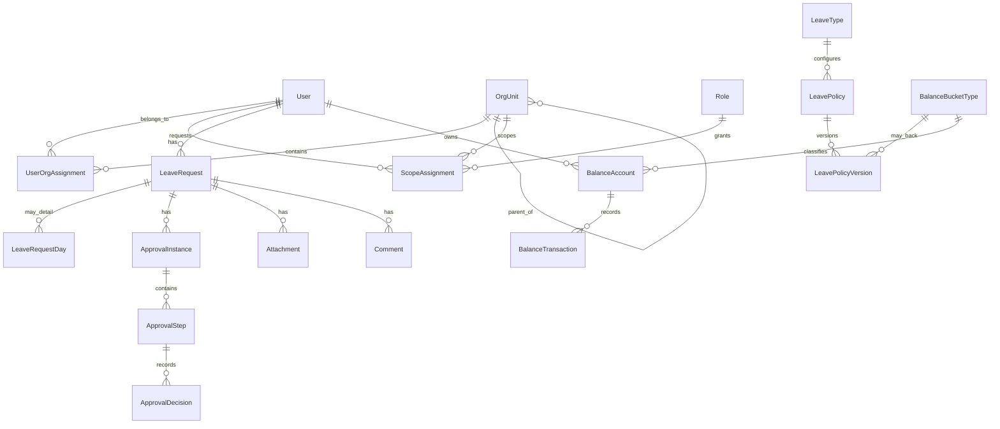

# Domain Model

The domain model represents leave requests, organizational scope, configurable policy versions, immutable balance transactions, approvals, documents, audit, and migration traceability.

## Aggregate map

## Main entities

| Entity | Responsibility |
| --- | --- |
| `User` | Local profile linked to Entra Object ID. It does not store corporate passwords. |
| `OrgUnit` | Organizational tree using `parentId`. |
| `UserOrgAssignment` | User membership in primary and optional secondary units. |
| `Role` / `Permission` | RBAC catalog of functional capabilities. |
| `ScopeAssignment` | User + role + root org unit + include-descendants flag. |
| `LeaveType` | User-visible leave type catalog entry. Policy versions decide whether a leave type consumes a balance bucket. |
| `LeavePolicy` | Stable company-wide or OrgUnit-scoped policy definition for a leave type. |
| `BalanceBucketType` | Balance concept such as vacation, study leave, or medical exams. |
| `LeavePolicyVersion` | Effective dated rule set for a leave type and optionally a unit. |
| `WorkingCalendar` | Stable configurable working calendar with weekday rules and dated exceptions. |
| `LeaveRequest` | Request with dates, AM/PM segments, calculated days, applied policy version, and state. |
| `LeaveRequestDay` | Optional per-day detail for complex calculation and half-days. |
| `ApprovalInstance` / `ApprovalStep` | Resolved workflow instance and approvers. |
| `ApprovalDecision` | Immutable approval decision. |
| `BalanceAccount` | User + bucket + period account. |
| `BalanceTransaction` | Immutable ledger entry for grants, reserves, consumption, release, refund, adjustment, and expiry. |
| `Comment` | Request comments with author and visibility. |
| `Attachment` | Document metadata only; bytes live in private storage. |
| `AuditEvent` | Security and business audit event. |
| `NotificationOutbox` | Pending notification events for reliable delivery. |
| `MigrationMapping` | Source SharePoint IDs mapped to internal IDs for traceability and reconciliation. |

## Domain invariants

- A leave request stores the policy version used for its calculation/approval.
- Historical policy versions must not be modified after they have been applied.
- A calculated balance is never directly edited.
- Balance corrections happen through compensating ledger transactions.
- Approval decisions are immutable evidence.
- Attachment content is not stored in relational domain tables.
- SharePoint column names and Graph structures never enter the domain model.

## Related documents

- [Database](database.md)
- [Authorization](authorization.md)
- [Leave policies](../product/leave-policies.md)
- [Workflows](../product/workflows.md)

## Implemented policy/version model

EP-04 implements `LeavePolicy` as the stable policy scoped to a LeaveType and optional OrgUnit, and `LeavePolicyVersion` as the exact effective-dated rule set. Draft versions can be edited, while published versions are immutable and resolver-visible. Future leave requests must store the exact published policy version used when evaluated, so later publications do not rewrite historical request semantics.

## Implemented working-calendar model

EP-05 implements `WorkingCalendar` as the stable calendar selected by policy versions that need business-day semantics. Calendar dates use `DateOnly`, not UTC timestamps. Each calendar owns exactly one configurable weekday rule for Monday through Sunday; there is no hardcoded global weekend concept. `WorkingCalendarException` stores dated overrides, and an explicit exception wins over the weekday rule. `IsWorkingDay = false` represents a non-working date, while `IsWorkingDay = true` represents an exceptional working date.

`LeavePolicyVersion.WorkingCalendarId` is required when `DayCountMode` or `NoticeDayCountMode` is `BUSINESS_DAYS`, and may be null when both modes are `CALENDAR_DAYS`. New publication rejects inactive calendars, while already-published historical versions remain readable if the referenced calendar is later deactivated.

## Implemented balance account and ledger model

EP-06 implements `BalanceAccount` as the stable grouping for one `User + BalanceBucket`. `BalanceLedgerEntry` is the immutable accounting record for `GRANT`, `RESERVE`, `RELEASE`, `CONSUME`, `REFUND`, `ADJUSTMENT`, and `EXPIRE`.

A balance account has no mutable balance field. Available and reserved balances are derived from ledger deltas. Future LeaveRequest integration will use reserve/release/consume/refund primitives, but EP-06 does not implement LeaveRequest.

## Implemented leave request model

EP-07 implements `LeaveRequest` as the aggregate for employee-owned drafts and submissions. The request stores `OrgUnitId` explicitly so historical scope is not re-derived from later assignment changes. Drafts keep `LeavePolicyVersionId`, `CalculatedDays`, and balance linkage empty. Submission freezes the exact published `LeavePolicyVersion` resolved by `StartDate`, stores calculated quantity, and moves only `DRAFT -> PENDING_APPROVAL`.

## Implemented approval decision model

EP-08 adds `LeaveRequestDecision` as immutable business history for one final decision per request. The implemented state machine is intentionally narrow: `PENDING_APPROVAL -> APPROVED` and `PENDING_APPROVAL -> REJECTED`.

Approval and rejection use explicit domain operations, not a generic status setter. Self-approval is prohibited. Decision scope is evaluated against the request's stored `OrgUnitId`. Multi-step workflows, routing tables, delegation, and quorum rules are intentionally deferred.
