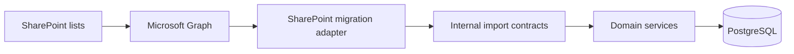

# Integrations Architecture

Microsoft 365 integrations are adapters around the application. They must not leak external schemas into the domain.

## Integration decisions

| Integration | Use | MVP |
| --- | --- | --- |
| Microsoft Entra ID | SSO, identity claims, stable user identifier. | Yes |
| Microsoft Graph for SharePoint Lists | Inventory, migration, reconciliation, and optional short coexistence reads. | Yes |
| Entra Groups | Optional membership import only if groups represent the real organizational model. | Optional |
| Outlook/Teams | Notifications with deep links to the application. | Optional / minimum email agreed by business |
| Microsoft 365 Calendars | Not a source of truth; future publication target for approved absences. | No |
| Private object storage | Attachment bytes and sensitive documents. | Yes |

## SharePoint boundary

SharePoint is a migration/historical source, not the operational source of truth. SharePoint list names, column names, content types, views, and Graph payload structures must stay inside the integration/migration layer.

## Migration approach

1. Inventory SharePoint lists, columns, types, relations, views, attachments, and implicit rules.
2. Define a formal SharePoint-to-domain mapping and identify data that cannot be mapped automatically.
3. Run a full trial import in a staging environment.
4. Reconcile counts, request states, balances, and attachments.
5. Preserve source IDs in `MigrationMapping`.
6. Clean invalid users, dates, duplicates, and unsupported states before cutover.
7. Freeze writes in SharePoint or implement controlled delta synchronization for a short transition.
8. Run final migration and reconciliation.
9. Promote PostgreSQL as the only editable source of truth.
10. Keep SharePoint read-only for the agreed retention window.

## Reconciliation criteria

- mapped/unmapped users
- request counts by year, type, and state
- consumed and pending days by user/bucket
- migrated, failed, and unsupported attachments
- source hashes or IDs to prevent duplicates
- RRHH-approved reconciliation report before go-live

## Related documents

- [Architecture overview](ARCHITECTURE.md)
- [Database](database.md)
- [Security](security.md)
