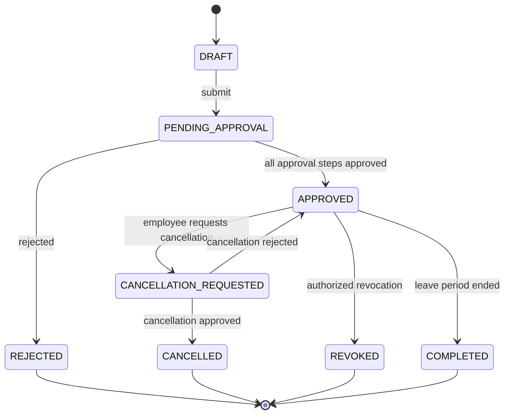

# Workflows

Leave workflows cover draft, submission, approval, rejection, cancellation, revocation, balance movement, audit, and notification.

## Request lifecycle



## States

| State | Meaning |
| --- | --- |
| `DRAFT` | Not submitted; no approval, reservation, or consumption. |
| `PENDING_APPROVAL` | Submitted and waiting for one or more approval steps. |
| `APPROVED` | Approved; balance consumed when applicable. |
| `REJECTED` | Rejected; any reservation is released. |
| `CANCELLATION_REQUESTED` | Employee requested cancellation of approved leave; leave remains active until resolved. |
| `CANCELLED` | Cancellation approved; balance returned according to policy. |
| `REVOKED` | Administrative revocation by authorized actor; reason required. |
| `COMPLETED` | Leave period ended; optional operational terminal state. |

## Target approval flow

1. Employee completes a request and the frontend asks the backend for prevalidation.
2. Backend resolves effective policy, calendar, balance, overlap, and capacity conflicts.
3. On submit, one transaction creates the request, reserves balance if applicable, creates approval workflow, and records audit.
4. The approval engine resolves the first approver from organization and policy.
5. Each decision is stored immutably with actor, timestamp, comment, and context.
6. When all steps complete, reservation becomes consumption. On rejection, reservation is released.
7. A domain/outbox event is recorded so notification failure does not roll back the business transaction.

This describes the broader target workflow. EP-08 implements one final approval decision. EP-09 implements cancellation, revocation, and manual create-for-others. EP-11 implements outbound workflow notification events through the transactional outbox and worker. Routing, multi-step approval, completion automation, and frontend notification-center behavior remain deferred.

## Cancellation flow

A cancellation request does not delete approved leave. While pending, the request is `CANCELLATION_REQUESTED` and remains an active overlap. Only approval of the cancellation changes the state to `CANCELLED` and refunds consuming balance. Rejection returns the request to `APPROVED`.

## Revocation flow

Revocation is administrative and distinct from employee-requested cancellation. It requires authorization, mandatory reason, and immutable history. EP-09 refunds consuming leave based on the frozen approved request.

## Related documents

- [Use cases](use-cases.md)
- [Leave policies](leave-policies.md)
- [API](../architecture/api.md)
- [Database](../architecture/database.md)

## Implemented EP-08 leave request approval

EP-08 supports the first approval workflow after submission:

```text
DRAFT -> PENDING_APPROVAL -> APPROVED
                         \-> REJECTED
```

There is one final approval decision. Multi-step approval, configurable routing, and completion automation are intentionally deferred. EP-11 sends outbound workflow notifications from committed outbox events; frontend notification-center behavior remains out of scope.

Approval consumes the existing reservation. Rejection releases it. Both use the frozen submitted request values and store immutable decision history.
