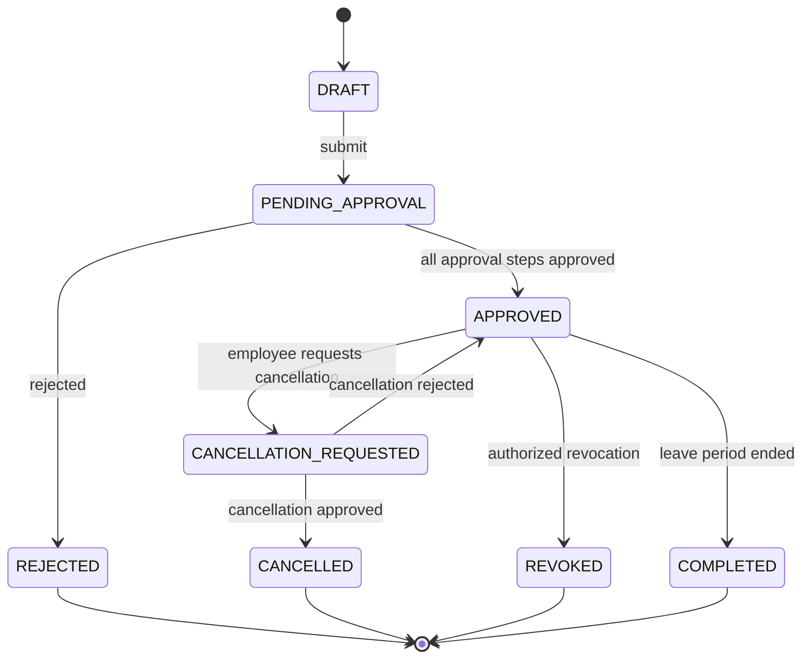

# Workflows

Leave workflows cover draft, submission, approval, rejection, cancellation, revocation, balance movement, audit, and notification.

## Request lifecycle

## States

| State | Meaning |
| --- | --- |
| `DRAFT` | Not submitted; no approval, reservation, or consumption. |
| `PENDING_APPROVAL` | Submitted and waiting for one or more approval steps. |
| `APPROVED` | Approved; balance consumed when applicable. |
| `REJECTED` | Rejected; any reservation is released. |
| `CANCELLATION_REQUESTED` | Employee requested cancellation of approved leave; leave remains active until resolved. |
| `CANCELLED` | Cancellation approved; balance returned according to policy. |
| `REVOKED` | Administrative revocation by authorized actor; reason required. |
| `COMPLETED` | Leave period ended; optional operational terminal state. |

## Approval flow

1. Employee completes a request and the frontend asks the backend for prevalidation.
2. Backend resolves effective policy, calendar, balance, overlap, and capacity conflicts.
3. On submit, one transaction creates the request, reserves balance if applicable, creates approval workflow, and records audit.
4. The approval engine resolves the first approver from organization and policy.
5. Each decision is stored immutably with actor, timestamp, comment, and context.
6. When all steps complete, reservation becomes consumption. On rejection, reservation is released.
7. A domain/outbox event is recorded so notification failure does not roll back the business transaction.

## Cancellation flow

A cancellation request does not delete or directly modify approved leave. While pending, the leave remains visible as approved with a cancellation-requested indicator. Only approval of the cancellation changes the state to `CANCELLED` and releases/refunds balance according to policy.

## Revocation flow

Revocation is administrative and distinct from employee-requested cancellation. It requires authorization, mandatory reason, and audit. The policy defines whether all, part, or none of the balance is returned.

## Related documents

- [Use cases](use-cases.md)
- [Leave policies](leave-policies.md)
- [API](../architecture/api.md)
- [Database](../architecture/database.md)
